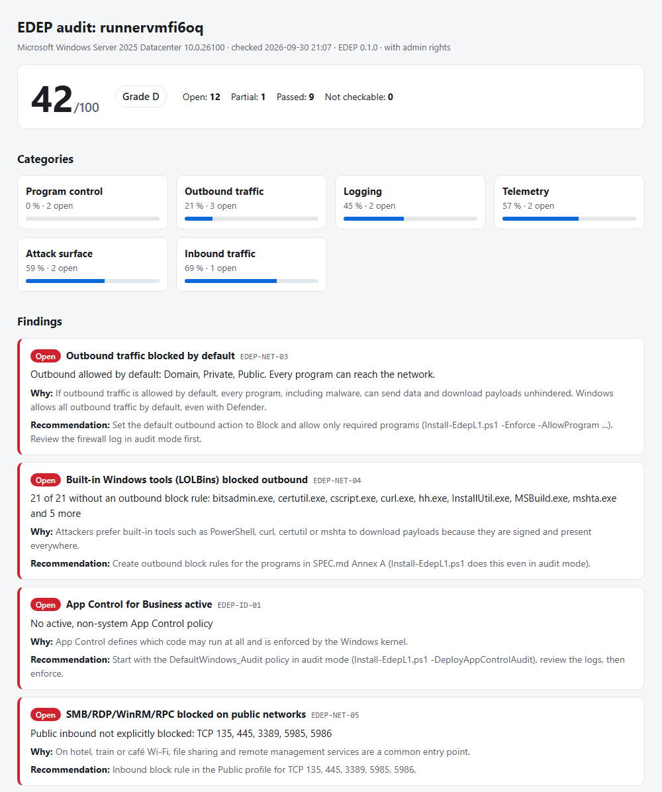

# E.D. Endpoint Profile (EDEP)

[](https://github.com/AndreZ1971/E.L.L.A.-Defence-Endpoint/actions/workflows/ci.yml) [](LICENSE) [](SPEC.md)

**[Deutsch](README.md) · English** · [Project page](https://andrez1971.github.io/E.L.L.A.-Defence-Endpoint/en/)

**Open security profile for Windows endpoints: outbound zero trust, telemetry sovereignty and deterministic isolation.**

EDEP defines what a Windows computer must technically enforce so that:

- No program talks to the network unless it is explicitly allowed to.
- The operating system sends only unavoidable telemetry, and the user can see it.
- Every block is logged locally.
- On detected data exfiltration the host isolates itself, deterministically, not on a model's suspicion.

EDEP is **not an antivirus**. It is designed to complement Microsoft Defender or another AV product.

> **Status:** draft 0.1.0. The specification is not yet sealed. The normative specification
> and the detailed documentation are currently written in German; the audit tool and this
> page are available in English.

## Free audit: how open is your Windows?

By default Windows lets every program send traffic outbound, even with Defender.
The audit shows in about a minute what applies to your computer. It **changes nothing**
and also runs without admin rights.

```powershell
# In the folder baseline\L1 (run as administrator for the complete result)
.\Invoke-EdepAudit.ps1 -Open
```

Result: a score from 0 to 100, categories (outbound and inbound traffic, program control,
telemetry, logging, attack surface) and, for every open item, an explanation with a concrete
recommendation, on the console and as an HTML report. The language follows the Windows display
language; `-Language en` or `-Language de` forces it.

<picture>
  <source media="(prefers-color-scheme: dark)" srcset="docs/images/audit-example-dark.png">
  
</picture>

<sub>Example report of an unhardened Windows Server 2025 (GitHub Actions runner, with admin rights), generated in CI.</sub>

## Don't believe it, verify it

| Question                                         | Answer                                                                                                                                           |
| ------------------------------------------------ | ------------------------------------------------------------------------------------------------------------------------------------------------ |
| Is what's written here true?                     | Every technical claim has a source or a measurement: [evidence register](docs/EVIDENCE.md). Anything not yet verified is openly marked ⏳ there. |
| Where do the facts come from?                    | 28 linked sources, mostly Microsoft Learn and MITRE ATT&CK: [SPEC, Annex B](SPEC.md#anhang-b--quellen)                                           |
| What can EDEP **not** do?                        | Residual risks and eight known bypasses, each with a test: [SPEC 3.3/3.4](SPEC.md#34-bekannte-umgehungen-normativ)                               |
| Where does EDEP deviate from Microsoft, and why? | [DD-12](docs/DESIGN-DECISIONS.md)                                                                                                                |
| How do I check it myself?                        | In 5 minutes without risk, in 30 minutes in a VM: [verify yourself](docs/VERIFY-YOURSELF.md)                                                     |
| Which mistakes were already found?               | [Errata](docs/EVIDENCE.md#errata)                                                                                                                |
| I found a hole.                                  | [SECURITY.md](SECURITY.md)                                                                                                                       |

## Levels

| Level           | Implementation                                                                     | Own code                     |
| --------------- | ---------------------------------------------------------------------------------- | ---------------------------- |
| **L1 Baseline** | Windows built-ins only (firewall, App Control, policies)                           | no, [scripts](baseline/L1/)  |
| **L2 Enforced** | Agent with WFP filters, program identity by signature/hash, boot-time filters      | yes, without a kernel driver |
| **L3 Isolated** | Deterministic emergency isolation, metadata anomaly detection, model advisory only | yes                          |

## Quick start L1

In **PowerShell as administrator** in the folder `baseline\L1`:

```powershell
# 0. For this session only: allow script execution (Windows blocks it by default)
Set-ExecutionPolicy -Scope Process -ExecutionPolicy Bypass

# 1. Only show what would happen
.\Install-EdepL1.ps1 -DeployAppControlAudit -WhatIf

# 2. Apply in audit mode (outbound still allowed, everything is logged)
.\Install-EdepL1.ps1 -DeployAppControlAudit

# 3. Check (add -ProbeUpdates to also measure update reachability)
.\Test-EdepL1.ps1

# 4. After reviewing the firewall log: block outbound by default
.\Install-EdepL1.ps1 -Enforce -DeployAppControlAudit -AllowWindowsUpdate `
    -AllowProgram "${env:ProgramFiles(x86)}\Microsoft\Edge\Application\msedge.exe"

# Undo (restores the state before the first application)
.\Restore-EdepL1.ps1
```

**Caution with `-Enforce`:** afterwards only programs with an allow rule have network access:
Windows core networking, the programs listed under `-AllowProgram` and programs with their own
Windows rules (Store apps). PowerShell, `curl.exe`, `certutil` and the other Annex A tools are
blocked outbound, including for `Install-Module` and `winget` scripts.

**Updates under `-Enforce` (measured, [run 1](conformance/runs/2026-10-03-Enterprise25H2-26200.9550-HyperV/run.md), [run 2](conformance/runs/2026-10-03-Pro26H2-26300.9457-HyperV/run.md), [run 3](conformance/runs/2026-10-03-Enterprise25H2-26200.9550-HyperV-Lauf3/run.md)):**
**In short: use enforce mode only if updates have their own defined path (WSUS, Intune, proxy). For single machines without one, audit mode, the LOLBin and telemetry blocks and App Control (audit) are the evidenced core.** The `-AllowWindowsUpdate` option improves things but is **not reliable** (see below).

without further measures, **Windows Update, Defender signature updates and BITS are not reachable** under
`-Enforce`. Allow rules with `-Service` do not take effect, because these services connect with the calling
user's token and without a service SID ([E-73, E-84](docs/EVIDENCE.md)). `Test-EdepL1` then reports
**EDEP-TEL-04 = FAIL** (14/15).

With **`-AllowWindowsUpdate`** the installer instead creates rules "program `svchost.exe`, TCP 80/443, only to the
update domains" (dynamic keywords of the Windows firewall; domain list with source and date in
`EdepL1.Common.ps1`). Measured: on Pro the **update search** succeeded from the second attempt (also after a restart without cache),
`svchost.exe` reaches nothing else ([E-88](docs/EVIDENCE.md)). **On Enterprise (run 3) all nine attempts failed in the first measurement block** (search, BITS, `Update-MpSignature`); eleven minutes later the search succeeded from the second attempt; the cause is unknown. **So it can also fail completely.** **BITS to Microsoft** succeeds from the second attempt, **Defender signature updates** only with
repeated attempts: the firewall learns the addresses from the DNS answer with a delay of a few seconds, an immediate first
attempt is rejected (E-12 to E-14, E-89). **Costs and limits:**
- Defender's **network protection** must be running; the installer sets it to audit mode if it was off, and
  `Restore` sets it back. This does not work with third-party antivirus (unmeasured).
- The firewall learns the addresses from observed DNS answers and discards them on restart. **The first
  connections may fail** (measured: one BITS attempt), later ones succeed.
- **Defender signature updates are not solved by this**: `Update-MpSignature` still fails, and `WdNisSvc` and
  `MDCoreSvc` are rejected ([E-89](docs/EVIDENCE.md)). Unmeasured: installing updates, the search after a restart
  with an empty cache, long-term operation.
- Use enforce mode only with a maintenance window and keep `Restore-EdepL1.ps1` ready. After a restore, verify the
  state with `Test-EdepL1.ps1`.

The installer and `Restore-EdepL1` ask before every step (installer: five, six with
`-DeployAppControlAudit`, one more with `-AllowWindowsUpdate`; restore: four plus one each for App Control policies,
keywords and network protection, where present). Confirm with the letter
shown: on German Windows **`J`** (or `A` for all), on English `y`. For scripts use `-Confirm:$false`.
`-AllowProgram` refuses paths that non-admins can modify (EDEP-NET-10).

Install and restore messages are currently German only.

## Contents

| Path                                                             | Contents                                                             |
| ---------------------------------------------------------------- | -------------------------------------------------------------------- |
| [SPEC.md](SPEC.md)                                               | Normative specification: threat model, requirements, levels (German) |
| [conformance/](conformance/README.md)                            | Conformance tests per requirement                                    |
| [baseline/L1/](baseline/L1/)                                     | Audit plus apply, check and restore for L1 (module `EDEP`)           |
| [tools/](tools/)                                                 | Build and sign the module, validate policies                         |
| [schema/edep-policy.schema.json](schema/edep-policy.schema.json) | Policy language (JSON Schema)                                        |
| [docs/EVIDENCE.md](docs/EVIDENCE.md)                             | Evidence register                                                    |
| [docs/DESIGN-DECISIONS.md](docs/DESIGN-DECISIONS.md)             | Why EDEP is built this way                                           |
| [docs/ROADMAP.md](docs/ROADMAP.md)                               | Milestones                                                           |

## What EDEP does not do

Attackers with administrator or kernel rights, the content of encrypted connections, abuse of
allowed programs and compromised signed software are out of scope. Details:
[SPEC.md, section 3.3](SPEC.md#33-ausdrücklich-nicht-im-geltungsbereich-restrisiken).
These limits are part of the standard and must not be omitted from any product description.

## License

[MIT](LICENSE)
