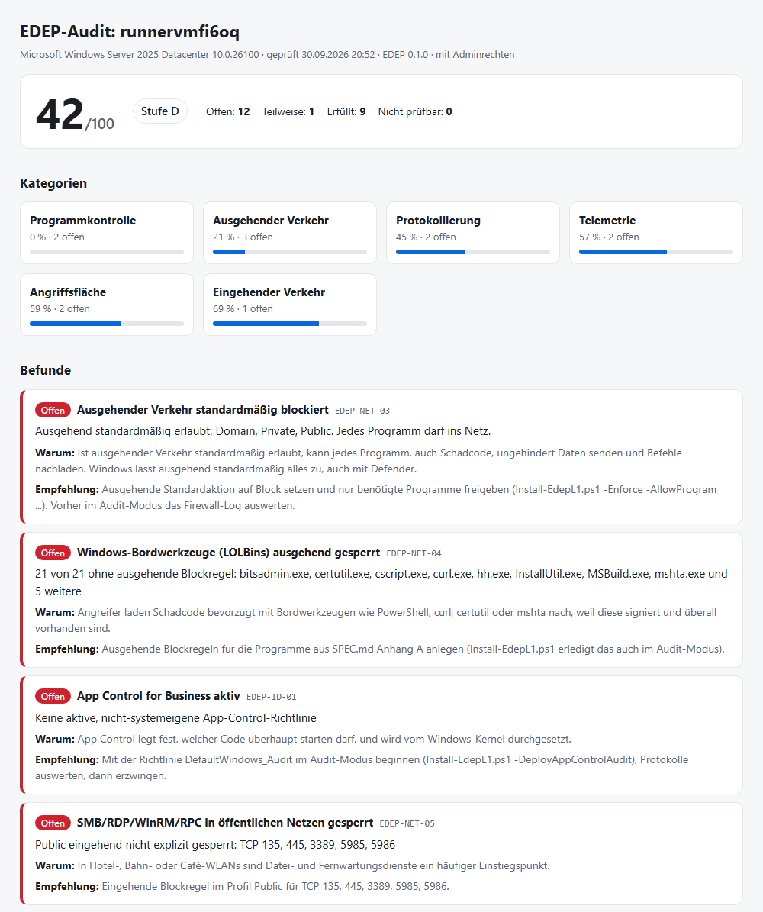

# E.D. Endpoint Profile (EDEP)

[](https://github.com/AndreZ1971/E.L.L.A.-Defence-Endpoint/actions/workflows/ci.yml) [](LICENSE) [](SPEC.md)

**Deutsch · [English](README.en.md)** · [Projektseite](https://andrez1971.github.io/E.L.L.A.-Defence-Endpoint/)

**Offenes Sicherheitsprofil für Windows-Endgeräte: Outbound-Zero-Trust, Telemetrie-Souveränität und deterministische Isolation.**

EDEP legt fest, was ein Windows-Rechner technisch erzwingen muss, damit gilt:

- Kein Programm spricht ins Netz, das nicht ausdrücklich dafür zugelassen ist.
- Das Betriebssystem überträgt nur die unvermeidliche Telemetrie, und der Nutzer sieht das.
- Jede Blockade ist lokal protokolliert.
- Bei erkanntem Datenabfluss isoliert sich der Host, deterministisch und nicht auf Modellverdacht.

EDEP ist **kein Antivirus**. Es ist als Ergänzung zu Microsoft Defender oder einem anderen AV-Produkt
gedacht.

> **Status:** Entwurf 0.1.0. Die Spezifikation ist noch nicht versiegelt.

## Kostenloses Audit: Wie offen ist dein Windows?

Windows lässt ausgehenden Verkehr standardmäßig für jedes Programm zu, auch mit Defender.
Das Audit zeigt in einer Minute, was davon auf deinem Rechner zutrifft. Es **ändert nichts**
und läuft auch ohne Adminrechte.

```powershell
# Im Ordner baseline\L1 (für das vollständige Ergebnis als Administrator)
.\Invoke-EdepAudit.ps1 -Open
```

Ergebnis: eine Punktzahl von 0 bis 100, Kategorien (ausgehender und eingehender Verkehr,
Programmkontrolle, Telemetrie, Protokollierung, Angriffsfläche) und für jeden offenen Punkt
eine Erklärung mit konkreter Empfehlung, in der Konsole und als HTML-Bericht. Die Sprache
richtet sich nach der Windows-Anzeigesprache; `-Language de` oder `-Language en` erzwingt sie.

<picture>
  <source media="(prefers-color-scheme: dark)" srcset="docs/images/audit-beispiel-dunkel.png">
  
</picture>

<sub>Beispielbericht eines ungehärteten Windows Server 2025 (GitHub-Actions-Runner, mit Adminrechten), erzeugt in der CI.</sub>

## Nicht glauben, prüfen

| Frage                                       | Antwort                                                                                                                                                 |
| ------------------------------------------- | ------------------------------------------------------------------------------------------------------------------------------------------------------- |
| Stimmt das, was hier steht?                 | Jede technische Aussage hat eine Quelle oder einen Messwert: [Nachweisregister](docs/EVIDENCE.md). Was noch nicht geprüft ist, steht dort offen als ⏳. |
| Woher stammen die Fakten?                   | 28 verlinkte Quellen, überwiegend Microsoft Learn und MITRE ATT&CK: [SPEC, Anhang B](SPEC.md#anhang-b--quellen)                                         |
| Was kann EDEP **nicht**?                    | Restrisiken und acht bekannte Umgehungen, jede mit Test: [SPEC 3.3/3.4](SPEC.md#34-bekannte-umgehungen-normativ)                                        |
| Wo weicht EDEP von Microsoft ab, und warum? | [DD-12](docs/DESIGN-DECISIONS.md)                                                                                                                       |
| Wie prüfe ich es selbst?                    | In 5 Minuten ohne Risiko, in 30 Minuten in einer VM: [Selbst prüfen](docs/VERIFY-YOURSELF.md)                                                           |
| Welche Fehler gab es schon?                 | [Errata](docs/EVIDENCE.md#errata)                                                                                                                       |
| Ich habe eine Lücke gefunden.               | [SECURITY.md](SECURITY.md)                                                                                                                              |

## Stufen

| Stufe           | Umsetzung                                                                            | Eigener Code                  |
| --------------- | ------------------------------------------------------------------------------------ | ----------------------------- |
| **L1 Baseline** | Nur Windows-Bordmittel (Firewall, App Control, Richtlinien)                          | nein, [Skripte](baseline/L1/) |
| **L2 Enforced** | Agent mit WFP-Filtern, Programmidentität per Signatur/Hash, Boot-Time-Filter         | ja, ohne Kernel-Treiber       |
| **L3 Isolated** | Deterministische Notfall-Isolation, Metadaten-Anomalieerkennung, Modell nur beratend | ja                            |

## Schnellstart L1

In einer **PowerShell als Administrator** im Ordner `baseline\L1`:

```powershell
# 0. Nur für diese Sitzung: Skriptausführung erlauben (Windows sperrt sie standardmäßig)
Set-ExecutionPolicy -Scope Process -ExecutionPolicy Bypass

# 1. Nur anzeigen, was passieren würde
.\Install-EdepL1.ps1 -DeployAppControlAudit -WhatIf

# 2. Im Audit-Modus anwenden (ausgehend bleibt noch erlaubt, alles wird protokolliert)
.\Install-EdepL1.ps1 -DeployAppControlAudit

# 3. Prüfen (mit -ProbeUpdates zusätzlich die Update-Erreichbarkeit messen)
.\Test-EdepL1.ps1

# 4. Nach Auswertung des Firewall-Logs: ausgehend standardmäßig blockieren
.\Install-EdepL1.ps1 -Enforce -DeployAppControlAudit -AllowWindowsUpdate `
    -AllowProgram "${env:ProgramFiles(x86)}\Microsoft\Edge\Application\msedge.exe"

# Rückgängig (stellt den Zustand vor der ersten Anwendung her)
.\Restore-EdepL1.ps1
```

**Achtung bei `-Enforce`:** Danach haben nur noch Programme mit Erlaubnisregel
Netzzugang: Windows-Kernnetzwerk, die unter `-AllowProgram` genannten Programme und
Programme mit eigenen Windows-Regeln (Store-Apps). PowerShell, `curl.exe`, `certutil` und
andere Anhang-A-Werkzeuge sind ausgehend gesperrt, auch für `Install-Module` und
`winget`-Skripte.

**Updates unter `-Enforce` (gemessen, [Lauf 1](conformance/runs/2026-10-03-Enterprise25H2-26200.9550-HyperV/run.md), [Lauf 2](conformance/runs/2026-10-03-Pro26H2-26300.9457-HyperV/run.md)):**
Ohne weitere Maßnahme sind unter `-Enforce` **Windows Update, Defender-Signaturupdates und BITS nicht
erreichbar**. Die Erlaubnisregeln mit `-Service` greifen nicht, weil diese Dienste mit dem Token des
aufrufenden Benutzers und ohne Dienst-SID verbinden ([E-73, E-84](docs/EVIDENCE.md)). `Test-EdepL1` meldet
dann **EDEP-TEL-04 = FAIL** (14/15).

Mit **`-AllowWindowsUpdate`** legt der Installer stattdessen Regeln „Programm `svchost.exe`, TCP 80/443, nur zu
den Update-Domains“ an (Dynamic Keywords der Windows-Firewall, Domainliste mit Quelle und Stand in
`EdepL1.Common.ps1`). Gemessen: Update-Suche und BITS zu Microsoft gelingen, `svchost.exe` erreicht sonst nichts
([E-88](docs/EVIDENCE.md)). **Kosten und Grenzen:**
- Der **Netzwerkschutz von Defender** muss laufen; der Installer stellt ihn auf den Audit-Modus, falls er aus war, und
  `Restore` stellt ihn zurück. Mit fremdem Virenschutz geht das nicht (ungemessen).
- Die Firewall lernt die Adressen aus beobachteten DNS-Antworten und verwirft sie beim Neustart. **Die ersten
  Verbindungen können scheitern** (gemessen: ein BITS-Versuch), spätere gelingen.
- **Defender-Signaturupdates sind damit nicht gelöst**: `Update-MpSignature` scheitert weiter, und `WdNisSvc` und
  `MDCoreSvc` werden abgewiesen ([E-89](docs/EVIDENCE.md)). Ungemessen: Installation von Updates, die Suche nach einem
  Neustart mit leerem Cache, Dauerbetrieb.
- Den Enforce-Modus nur mit einem Wartungsfenster einsetzen und `Restore-EdepL1.ps1` bereithalten. Nach einer
  Wiederherstellung den Zustand mit `Test-EdepL1.ps1` prüfen.

Installer und `Restore-EdepL1` fragen vor jedem Schritt nach (Installer: fünf, mit
`-DeployAppControlAudit` sechs, mit `-AllowWindowsUpdate` eine weitere; `Restore`: vier plus je eine für App-Control-Richtlinien,
Schlüsselwörter und Netzwerkschutz, soweit vorhanden). Bestätigt wird
mit dem angezeigten Buchstaben: auf deutschem Windows **`J`** (oder `A` für alle), auf englischem
`y`. Für Skripte: `-Confirm:$false`.

Die Blocklisten stützen sich zum Teil auf Programmpfade. Wird eine Richtlinie per
Gruppenrichtlinie oder Intune verteilt, überschreibt diese die lokalen Einstellungen.
`Test-EdepL1.ps1` prüft deshalb immer den **wirksamen** Zustand.

## Inhalt

| Pfad                                                             | Inhalt                                                                  |
| ---------------------------------------------------------------- | ----------------------------------------------------------------------- |
| [SPEC.md](SPEC.md)                                               | Normative Spezifikation: Bedrohungsmodell, Anforderungen, Stufen        |
| [conformance/](conformance/README.md)                            | Konformitätstests je Anforderung                                        |
| [baseline/L1/](baseline/L1/)                                     | Audit sowie Anwenden, Prüfen und Wiederherstellen für L1 (Modul `EDEP`) |
| [tools/](tools/)                                                 | Modul bauen, signieren, Richtlinien validieren                          |
| [schema/edep-policy.schema.json](schema/edep-policy.schema.json) | Richtliniensprache (JSON Schema)                                        |
| [examples/policy.example.yaml](examples/policy.example.yaml)     | Beispielrichtlinie                                                      |
| [docs/DESIGN-DECISIONS.md](docs/DESIGN-DECISIONS.md)             | Warum EDEP so gebaut ist, und was vom ersten Konzept korrigiert wurde   |
| [docs/L2-AGENT-ARCHITECTURE.md](docs/L2-AGENT-ARCHITECTURE.md)   | Referenzarchitektur für den L2-Agenten                                  |
| [docs/ROADMAP.md](docs/ROADMAP.md)                               | Meilensteine                                                            |
| [docs/archive/](docs/archive/)                                   | Ursprüngliche Konzeptpapiere (nicht mehr gültig)                        |

## Was EDEP nicht leistet

Angreifer mit Administrator- oder Kernel-Rechten, Inhalte verschlüsselter Verbindungen,
Missbrauch zugelassener Programme und kompromittierte signierte Software liegen außerhalb
des Geltungsbereichs. Details stehen in [SPEC.md, Abschnitt 3.3](SPEC.md#33-ausdrücklich-nicht-im-geltungsbereich-restrisiken).
Diese Grenzen sind Teil der Norm und dürfen in keiner Produktbeschreibung fehlen.

## Lizenz

[MIT](LICENSE)
